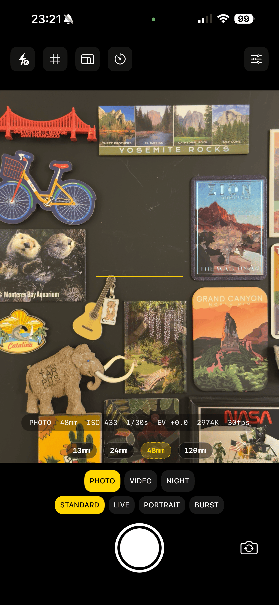
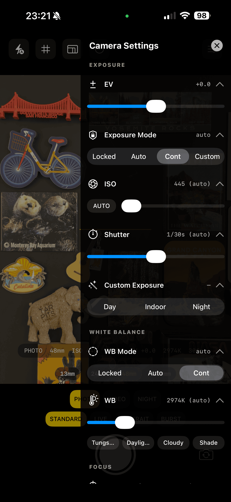
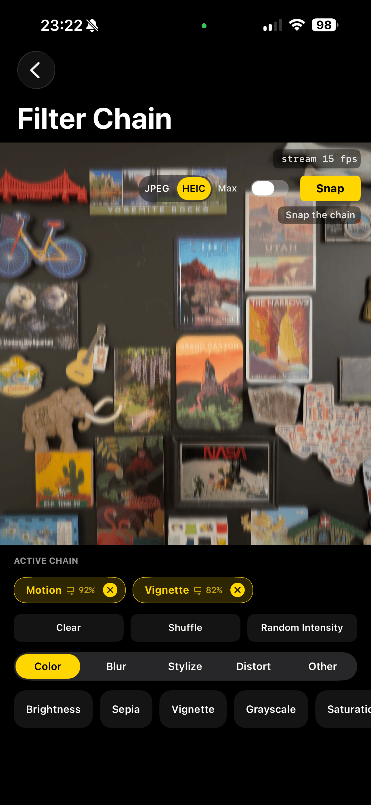

# Prism

[](https://swift.org)
[](https://developer.apple.com/ios/)
[](LICENSE)

Camera pipeline Swift Package for iOS 18+, built on Swift 6.2 strict concurrency.

- Actor-isolated `AVCaptureSession` with a `@MainActor` facade and `AsyncStream` event delivery.
- Async/await capture: still, Live Photo, Portrait, burst, long-exposure night composite, video.
- Full manual surface: exposure / ISO / shutter / lens position / focus / white balance / HDR / low-light / frame rate / stabilization.
- iOS 17 `AVCaptureDevice.RotationCoordinator`, iOS 17/18 photo features (responsive capture, deferred photo delivery, zero shutter lag).
- Metal-backed Core Image filter pipeline with 20 built-in filters and correct per-filter intensity blending via `CIBlendWithMask`.
- Metal preview view + UIKit components (shutter, focus, grid, level, aspect mask, settings drawer).

## Installation

Swift Package Manager — add Prism in Xcode (File → Add Package Dependencies…) or in `Package.swift`:

```swift
dependencies: [
    .package(url: "https://github.com/luminoid/Prism.git", from: "0.1.0"),
],
targets: [
    .target(
        name: "YourApp",
        dependencies: [
            .product(name: "PrismCore", package: "Prism"),
            .product(name: "PrismUI",   package: "Prism"), // optional, UIKit + Metal preview
        ]
    ),
]
```

Requires iOS 18+, Swift 6.2.

## Architecture

```
PrismCore  Camera (PRMCameraActor + PRMCamera facade), capture helpers,
           AVCaptureDevice extensions, filter pipeline, utilities. No UI.

PrismUI    Metal preview view + UIKit camera components.
           Depends on PrismCore. `defaultIsolation(MainActor)`. No SnapKit.
```

```
Sources/PrismCore/
├── Camera/      PRMCameraActor, PRMCamera (+Observers), PRMCameraSession (+Format),
│                PRMCameraConfiguration, PRMCameraDevice, PRMCameraState,
│                PRMRotationCoordinator, PRMPermissions, PRMSessionError
├── Capture/     PRMPhotoCapture (still / Live / Portrait / burst, async),
│                PRMPhotoSettings, PRMPhoto, PRMLivePhoto, PRMPortraitPhoto,
│                PRMNightModeCapture, PRMVideoRecorder + PRMRecording, PRMDepthCapture
├── Device/      AVCaptureDevice +Zoom/Torch/Exposure/WhiteBalance/FrameRate/
│                ISO/Lens/HDR/Depth/Configuration, AVCaptureConnection+Stabilization,
│                PRMLens
├── Filter/      PRMFilter, PRMFilterRenderer, PRMBasicFilterRenderer, PRMFilterChain,
│                PRMFilterPipeline, PRMBufferPoolAllocator, PRMRenderContext,
│                PRMVideoFrame, Filters/{Color,Blur,Stylize,Distortion,PortraitBokeh}
└── Utilities/   PRMLogger, PRMStreamRegistry, PRMTempFile, PRMImage

Sources/PrismUI/
├── Preview/     PRMPreviewView + Shaders/PassThrough.metal
└── Components/  PRMShutterButton, PRMFocusIndicatorView, PRMGridView,
                 PRMLevelIndicatorView, PRMAspectRatioMaskView, PRMCaptureEventHelper,
                 PRMSettingsDrawerView, PRMSettingsRow
```

## Features

### Camera & capture

- **Actor-isolated session** — `@PRMCameraActor` serializes every `AVCaptureSession` mutation; `PRMCamera` is the `@MainActor` facade with `AsyncStream<PRMCameraState>` / `errorStream` / `interruptionStream`.
- **Async/await capture** — `try await camera.capturePhoto(settings:)` → `PRMPhoto`; `captureLivePhoto(settings:)` → `PRMLivePhoto` (still + paired movie URL); `capturePortraitPhoto(settings:)` → `PRMPortraitPhoto` (still + depth + portrait effects matte); `captureBurst(count:settings:)` → `[PRMPhoto]`; `PRMVideoRecorder.start()` / `stop()` → `PRMRecording`.
- **Night mode** — `PRMNightModeCapture(capture:context:).capture(frameCount:perFrameDuration:iso:)` averages N captures into a long-exposure composite.
- **Manual controls** — `prm_setZoom`, `prm_setTorch`, `prm_setExposureBias`, `prm_setExposureMode`, `prm_setCustomExposure`, `prm_setISO`, `prm_setShutterSpeed`, `prm_setLensPosition`, `prm_setFocusMode`, `prm_lockWhiteBalance`, `prm_setFrameRate`, `prm_setVideoHDR`, `prm_setLowLightBoost`, `prm_setStabilization`. All surface on `PRMCamera` as `await camera.setX(...)`.
- **Rotation coordinator** — iOS 17+ `AVCaptureDevice.RotationCoordinator` exposed as `AsyncStream<CGFloat>` for preview + capture angles.
- **Permissions** — async `PRMPermissions.requestCameraAccess()` / `requestMicrophoneAccess()`.
- **iOS 17/18 photo features** — `enableResponsiveCapture`, `enableAutoDeferredPhotoDelivery`, `enableZeroShutterLag`, `enableLivePhoto`, `enableDepthDataDelivery`, `enablePortraitEffectsMatteDelivery`, `preferredVideoStabilizationMode`.
- **Runtime format swap** — `await camera.setHighResolutionPhotoFormat(true)` promotes `activeFormat` to the 48MP-capable format on iPhone 14 Pro+ / 15 Pro+ wide camera (auxiliary delivery flags reconciled per Apple dev-forum 715452); `await camera.enableDepthFormat()` swaps to a depth-capable format for Portrait so depth ancillaries arrive populated.
- **Multitasking camera access** — iPad opt-in via `enableMultitaskingCameraAccess`.
- **Lens descriptors** — `PRMLens` exposes raw 35mm-equivalent focal length per physical camera; opt-in `snapping(to:tolerance:)` for marketing-friendly values.

### Filter pipeline

- **Value-type `PRMFilter`** — Sendable protocol, `func render(_ image: CIImage) -> CIImage`. No `AnyObject` requirement.
- **Shared render context** — one Metal-backed `CIContext` per `PRMFilterPipeline` with `.cacheIntermediates: false` (per WWDC '20).
- **`PRMFilterPipeline`** — `AVCaptureVideoDataOutputSampleBufferDelegate` delivering frames via callback or `AsyncStream<PRMVideoFrame>`. `discardsLateVideoFrames = true`.
- **`PRMFilterChain`** — correct per-filter intensity blending using `CIBlendWithMask` against the previous step's output (fixes a subtle bug present in many filter-stack implementations).
- **20 built-in filters** — Color: Brightness, Contrast, Saturation, HueRotation, Grayscale, Sepia, Vignette. Blur: Gaussian, Motion, Zoom. Stylize: Pixellate, Comic, Pointillize, Edges. Distortion: Bump, Twirl, Pinch, Vortex. Plus PortraitBokeh (matte- or depth-driven `CIDepthBlurEffect`) and PassThrough.

### PrismUI

- **`PRMPreviewView`** — `MTKView` with lock-protected latest-frame buffer drawn on the display link, no per-frame Task / MainActor hop.
- **`PRMSettingsDrawerView`** — trailing-edge slide-in drawer with sectioned scroll and collapsible `PRMSettingsRow` controls.
- **`PRMShutterButton`** — photo / video / recording-active modes, tap + long-press.
- **`PRMFocusIndicatorView`** — animated tap-to-focus square, Reduce Motion aware.
- **`PRMGridView`** — rule of thirds, golden ratio, crosshair, Fibonacci spiral.
- **`PRMAspectRatioMaskView`** — 4:3 / 16:9 / 1:1 / full frame letterbox.
- **`PRMLevelIndicatorView`** — CoreMotion gravity-based horizon, hysteresis + snap-to-zero.
- **`PRMCaptureEventHelper`** — iOS 17.2+ `AVCaptureEventInteraction` wrapper for the Camera Control + volume buttons.

## Quick start

```swift
import PrismCore
import PrismUI

@MainActor
final class CameraVC: UIViewController {
    private let camera = PRMCamera()
    private lazy var renderContext = PRMRenderContext()!
    private lazy var pipeline = PRMFilterPipeline(context: renderContext)
    private lazy var preview = PRMPreviewView(context: renderContext)

    override func viewDidLoad() {
        super.viewDidLoad()
        view.addSubview(preview)
        preview.frame = view.bounds
        preview.autoresizingMask = [.flexibleWidth, .flexibleHeight]

        Task {
            guard await PRMPermissions.requestCameraAccess() else { return }
            try await camera.configure(PRMCameraConfiguration())
            await camera.session.setVideoDataOutputDelegate(pipeline)
            pipeline.onFrame = { [weak self] frame in
                self?.preview.update(frame.pixelBuffer)
            }
            await camera.start()
        }
    }
}
```

See [Example/Sources/StudioViewController.swift](Example/Sources/StudioViewController.swift) for the full DSLR-grade integration.

## Example app

`Example/PrismExample.xcodeproj` (XcodeGen) ships three demo screens:

1. **Permissions** — camera + microphone status pills and request flow.
2. **Studio** — DSLR-grade camera: preview, lens picker (35mm-equivalent), tap-to-focus, pinch-to-zoom, vertical drag for exposure bias, top-bar toggles (torch / grid / aspect / timer / burst / settings), telemetry strip (mode, zoom, ISO, shutter, EV, WB, frame rate), mode strip with PHOTO / LIVE / PORTRAIT / PANO / VIDEO / SLO-MO / NIGHT, and a slide-in settings drawer covering every supported AVFoundation API.
3. **Filter Chain** — real-time multi-filter editor with reorderable active pills, per-filter intensity sheet, and a library tabbed by category.

| Studio | Settings drawer | Filter chain |
|---|---|---|
|  |  |  |

Regenerate the Xcode project:

```bash
cd Example && xcodegen generate
```

The Example app uses SnapKit for its own layout — it is a private demo dependency, not a library one. Prism itself has no external SPM dependencies.

## Build & test

```bash
xcodebuild build -scheme Prism-Package -destination 'platform=iOS Simulator,name=iPhone 17,OS=26.2' CODE_SIGNING_ALLOWED=NO
xcodebuild test  -scheme Prism-Package -destination 'platform=iOS Simulator,name=iPhone 17,OS=26.2' CODE_SIGNING_ALLOWED=NO

make check   # SwiftLint + SwiftFormat
```

Device-touching paths (AVCaptureDevice extensions, photo / video / depth capture start-stop) can't run on simulator because `AVCaptureDevice.default(for: .video)` returns `nil`. Those modules are covered via value-type tests, API-surface KeyPath locks, and Sendable round-trip checks. Hardware paths exercise via the Example app and the manual test plan.

## Stats

| Metric | Count |
|--------|-------|
| Source files | 58 Swift + 1 Metal |
| PrismCore | 49 files |
| PrismUI | 9 files |
| Tests | 142 across 44 suites |
| Built-in filters | 20 |
| Example screens | 3 |

## Privacy manifest (for consuming apps)

Prism does not ship a `PrivacyInfo.xcprivacy` — Apple aggregates privacy reports at the app bundle level, so the manifest belongs in the consuming app. Add the following to your app's `PrivacyInfo.xcprivacy`:

| API category | Reason code | Why |
|---|---|---|
| `NSPrivacyAccessedAPICategoryFileTimestamp` | `C617.1` | `PRMTempFile` reads attributes (duration, size) of video files it writes. |
| `NSPrivacyAccessedAPICategoryDiskSpace` | `85F4.1` | Only if your app gates recording on available disk space; Prism itself does not read disk space. |

Info.plist keys: `NSCameraUsageDescription` (always), `NSMicrophoneUsageDescription` (if `includesAudio: true`), `NSPhotoLibraryAddUsageDescription` (if you save captures via `PHPhotoLibrary` — Prism itself returns `Data` / `URL` and never touches `PHPhotoLibrary`).

Prism does not access UserDefaults, system boot time, or active keyboards, so those categories don't apply.

## License

MIT — see [LICENSE](LICENSE).
