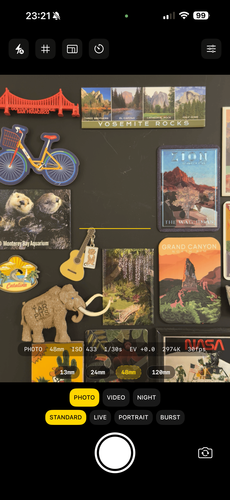
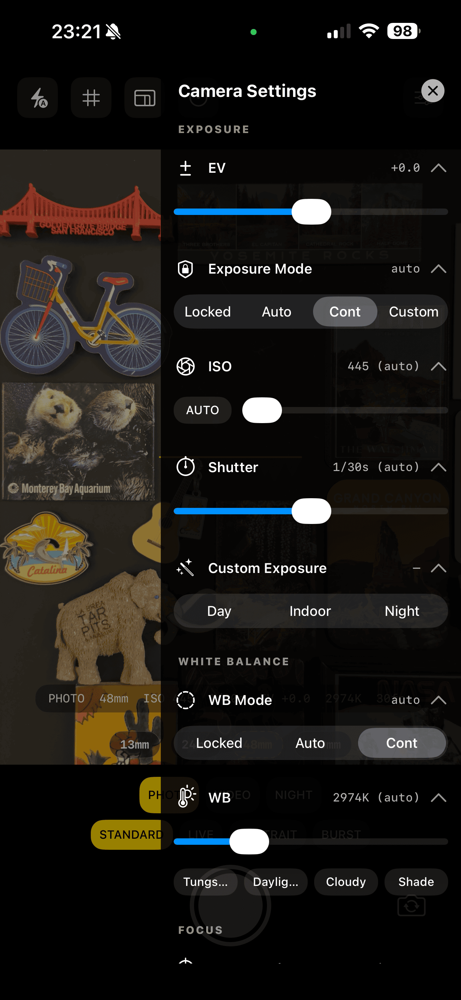
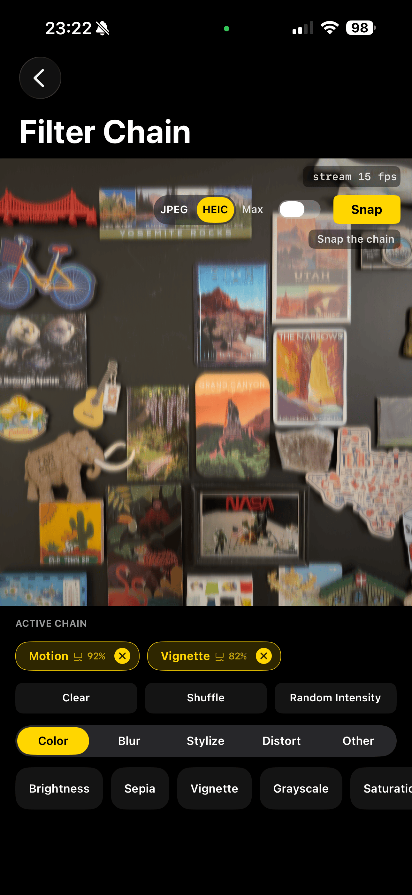

# Prism

[](https://swift.org)
[](https://developer.apple.com/ios/)
[](https://github.com/Luminoid/Prism/releases/latest)
[](LICENSE)

Camera pipeline Swift Package for iOS 18+, built on Swift 6 strict concurrency.

- Actor-isolated `AVCaptureSession` with a `@MainActor` facade and `AsyncStream` event delivery.
- Async/await capture: still, Live Photo, Portrait (with a depth-effect readiness monitor), burst, Night mode (frames stacked from the live stream, aligned and brightened), video.
- Full manual surface: exposure / ISO / shutter / lens position / focus / white balance / HDR / low-light / frame rate / stabilization.
- iOS 17 `AVCaptureDevice.RotationCoordinator`, iOS 17/18 photo features (responsive capture, deferred photo delivery, zero shutter lag).
- iOS 26 / 27 capture APIs: priority modes and variable aperture, exposure signals, lens lock, subject tracking, Cinematic Video, focus and exposure rects, lens smudge detection, dynamic aspect ratio with Smart Framing, AirPods Camera Control. All availability-gated, so iOS 18 deployments are unaffected.
- Metal-backed Core Image filter pipeline with 20 built-in filters and correct per-filter intensity blending via `CIBlendWithMask`.
- Metal preview view + UIKit components (shutter, focus, grid, level, aspect mask, settings drawer).

## Installation

Swift Package Manager: add Prism in Xcode (File → Add Package Dependencies…) or in `Package.swift`:

```swift
dependencies: [
    .package(url: "https://github.com/luminoid/Prism.git", from: "0.2.0"),
],
targets: [
    .target(
        name: "YourApp",
        dependencies: [
            .product(name: "PrismCore", package: "Prism"),
            .product(name: "PrismUI",   package: "Prism"), // optional, UIKit + Metal preview
        ]
    ),
]
```

Deploys to iOS 18+. Building needs Xcode 27 (Swift 6.4, iOS 27 SDK), because the iOS 26 / 27 APIs are compiled in behind availability checks.

## Architecture

```
PrismCore  Camera (PRMCameraActor + PRMCamera facade), capture helpers,
           AVCaptureDevice extensions, filter pipeline, utilities. No UI.

PrismUI    Metal preview view + UIKit camera components.
           Depends on PrismCore. `defaultIsolation(MainActor)`. No SnapKit.
```

```
Sources/PrismCore/
├── Camera/      PRMCameraActor, PRMCamera (+Observers, +ManualControls, +SessionHealth,
│                +Tracking, +Framing), PRMCameraSession (+Format, +Controls, +State,
│                +DeviceObservers, +Features, +Metadata, +Cinematic), PRMCameraConfiguration,
│                PRMCameraDevice, PRMCameraState, PRMRotationCoordinator, PRMPermissions,
│                PRMSessionError, PRMSessionHealth, PRMFraming, PRMCinematicVideo,
│                PRMDetectedObject, PRMMetadataRouter, PRMVideoFrameRouter,
│                PRMCameraSession+NightCapture
├── Capture/     PRMPhotoCapture (+Delegate, +Encoding: still / Live / Portrait / burst),
│                PRMPhotoSettings, PRMPhoto, PRMLivePhoto, PRMPortraitPhoto,
│                PRMPortraitReadiness, PRMNightModeCapture, PRMVideoRecorder + PRMRecording,
│                PRMDepthCapture, PRMOutputResolver,
│                Night/{PRMNightTypes, PRMNightPlanner, PRMNightStacker, PRMNightRegistration,
│                PRMNightMerger + PRMNightMerge.metal, PRMNightTone}
├── Device/      AVCaptureDevice +Zoom/Torch/Exposure/Aperture/WhiteBalance/FrameRate/
│                ISO/Lens/FocusTracking/Cinematic/HDR/Depth/AspectRatio/SmudgeDetection/
│                Configuration, AVCapturePhotoOutput+Readiness,
│                AVCaptureConnection+Stabilization, PRMLens, PRMExposureValue
├── Filter/      PRMFilter, PRMFilterRenderer, PRMBasicFilterRenderer, PRMFilterChain,
│                PRMFilterPipeline, PRMBufferPoolAllocator, PRMRenderContext,
│                PRMVideoFrame, Filters/{Color,Blur,Stylize,Distortion,PortraitBokeh}
└── Utilities/   PRMLog (+Categories), PRMStreamRegistry, PRMTempFile, PRMImage

Sources/PrismUI/
├── Preview/     PRMPreviewView + Shaders/PassThrough.metal
├── Components/  PRMShutterButton, PRMFocusIndicatorView, PRMGridView,
│                PRMLevelIndicatorView, PRMAspectRatioMaskView, PRMCaptureEventHelper,
│                PRMSettingsDrawerView, PRMSettingsRow
└── Resources/   en.lproj/Localizable.strings (VoiceOver strings)
```

## Features

### Camera & capture

- **Actor-isolated session**: `@PRMCameraActor` serializes every `AVCaptureSession` mutation; `PRMCamera` is the `@MainActor` facade with `AsyncStream<PRMCameraState>` / `errorStream` / `interruptionStream`.
- **Async/await capture**: `PRMPhotoCapture(session: camera.session)` captures with `try await capturePhoto(settings:)` → `PRMPhoto`; `captureLivePhoto(settings:)` → `PRMLivePhoto` (still + paired movie URL); `capturePortraitPhoto(settings:)` → `PRMPortraitPhoto` (still + depth + portrait effects matte); `captureBurst(count:settings:)` → `[PRMPhoto]`; `PRMVideoRecorder.start()` / `stop()` → `PRMRecording`. Each capture waits for the photo output to finish rebuilding after a reconfigure, then checks its settings against it, instead of crashing in AVFoundation. `PRMPhotoSettings.rotationAngle(_:)` saves landscape shots upright.
- **Night mode**: `PRMNightModeCapture(session:context:).capture(_:progress:)` → `PRMNightPhoto`. It plans the exposure from how dark the scene is (`plan(_:)`), holds the camera there while it gathers frames from the live stream for 1 to 3 seconds (up to 10 when `isStable`), aligns them with Vision, leaves out what moved, merges them on the GPU, then brightens by up to 3 EV with a highlight shoulder and noise reduction. Progress reports drive a countdown. Needs a physical camera (`.builtInWideAngleCamera` on Pro iPhones).
- **Portrait readiness**: `PRMPortraitReadinessMonitor(session:)` streams `PRMPortraitReadiness` (`.ready`, `.moveFarther`, `.moveCloser`, `.needsMoreLight`) from a live depth stream, face and body detections and the exposure, for a "NATURAL LIGHT" style indicator.
- **Manual controls**: `prm_setZoom`, `prm_setTorch`, `prm_setExposureBias`, `prm_setExposureMode`, `prm_setCustomExposure`, `prm_setISO`, `prm_setShutterSpeed`, `prm_setLensPosition`, `prm_setFocusMode`, `prm_lockWhiteBalance`, `prm_setFrameRate`, `prm_setVideoHDR`, `prm_setLowLightBoost`, `prm_setStabilization`. All surface on `PRMCamera` as `await camera.setX(...)`.
- **Rotation coordinator**: iOS 17+ `AVCaptureDevice.RotationCoordinator` exposed as `AsyncStream<CGFloat>` for preview + capture angles, plus `portraitFrameRotation(connectionAngle:)` for a view that draws video-data frames itself: it subtracts what the connection already rotated, which matters on the Center Stage front camera of iPhone 17 and later (its connection defaults to 270°).
- **Permissions**: async `PRMPermissions.requestCameraAccess()` / `requestMicrophoneAccess()`.
- **iOS 17/18 photo features**: `enableResponsiveCapture`, `enableAutoDeferredPhotoDelivery`, `enableZeroShutterLag`, `enableLivePhoto`, `enableDepthDataDelivery`, `enablePortraitEffectsMatteDelivery`, `preferredVideoStabilizationMode`.
- **Runtime format swap**: `await camera.setHighResolutionPhotoFormat(true)` promotes `activeFormat` to the 48MP-capable format on iPhone 14 Pro+ / 15 Pro+ wide camera (auxiliary delivery flags reconciled per Apple dev-forum 715452); `await camera.enableDepthFormat()` swaps to a depth-capable format for Portrait so depth ancillaries arrive populated.
- **Multitasking camera access**: iPad opt-in via `enableMultitaskingCameraAccess`.
- **Lens descriptors**: `PRMLens` exposes the 35mm-equivalent focal length per physical camera: Apple's nominal value on iOS 26+, otherwise derived from the field of view, with opt-in `snapping(to:tolerance:)` for marketing-friendly values.

### iOS 26 / 27

Every API in this section is availability-gated. On older systems the capability flags on `PRMCameraDevice` read `false` and the `PRMCameraState` fields keep their defaults. Where a feature isn't available, the setters behave in one of three ways:

- Most report `PRMSessionError.unsupportedConfiguration` (or `.exposureCombinationUnsupported`) on `errorStream()`.
- `setCinematicVideoEnabled(_:)`, `setDynamicAspectRatio(_:)` and `applyFraming(_:)` throw.
- `setLensSmudgeDetection(interval:)`, `setLowLightVideoNoiseReduction(_:)`, `setSmartFraming(enabledFramings:)` and `setCinematicMetadataCapture(_:)` do nothing; check the matching `PRMCameraDevice` flag first.

```swift
// Shutter priority (iOS 27): lock 1/250 s, let ISO (and a variable aperture) keep metering.
await camera.setShutterPriority(seconds: 1.0 / 250)

// Tap-to-track (iOS 27): continuous-AF taps now follow the subject.
await camera.setContinuousAutoFocusTrackingEnabled(true)
await camera.setFocusAndExposure(focusMode: .continuousAutoFocus, exposureMode: .continuousAutoExposure, at: devicePoint)

// Cinematic Video (iOS 26): shallow depth of field in recorded video.
try await camera.setCinematicVideoEnabled(true)
await camera.setCinematicSimulatedAperture(2.8)
```

- **Priority modes and variable aperture (iOS 27)**: `setExposure(aperture:shutterSeconds:iso:)` takes `.fixed(value)`, `.current` or `.auto` per axis, with `setShutterPriority(seconds:)`, `setISOPriority(_:)` and `setAperturePriority(_:)` as shortcuts. `state.autoExposureAxes` and `state.lensAperture` report what the device is doing.
- **Exposure signals (iOS 27)**: `setExposureSignals(_:)` steers auto exposure toward subject motion, group photos, documents, starbursts or flicker avoidance.
- **Lens lock (iOS 27)**: `lockLens(.builtInTelephotoCamera)` keeps a multi-lens camera on one lens in low light.
- **Subject tracking (iOS 27)**: `setContinuousAutoFocusTrackingEnabled(_:)` and `setContinuousAutoFocusTrackingBias(_:)`; `detectedObjectsStream()` carries the tracked subject's bounds.
- **Cinematic Video (iOS 26)**: `setCinematicVideoEnabled(_:)` (or `PRMCameraConfiguration.enableCinematicVideo`), `setCinematicFocus(_:)`, `setCinematicSimulatedAperture(_:)`, and on iOS 27 `setCinematicMetadataCapture(_:)` for post-capture focus editing. Which cameras run it depends on the iPhone (Apple documents the back Dual Wide and front TrueDepth cameras; an iPhone 18 Pro Max runs it on the back wide camera), and the Triple camera Pro iPhones open by default never does, so enabling it there switches to a camera that does and disabling switches back (`PRMCameraDevice.cinematicVideoDeviceType` names the camera). It survives camera switches; while it's on, Prism refuses the focus, frame-rate and format changes AVFoundation forbids.
- **Focus and exposure rects (iOS 26)**: `setFocusAndExposure(focusMode:exposureMode:in:)` and `defaultFocusRect(for:)`.
- **Calibrated white balance presets (iOS 26)**: `lockWhiteBalance(preset:)` locks to Apple's values for each illuminant.
- **Session health**: lens smudge detection (iOS 26, `lensSmudgeDetectionInterval` / `setLensSmudgeDetection(interval:)`), low-light video noise reduction (iOS 27), system pressure and interruption reason on `PRMCameraState`, deferred output start (iOS 26, `PRMCameraConfiguration.deferredStart`), AirPods as a high-quality microphone (iOS 26).
- **Dynamic aspect ratio and Smart Framing (iOS 26)**: `setDynamicAspectRatio(_:)`, `setSmartFraming(enabledFramings:)`, `framingRecommendationStream()` and `applyFraming(_:)` for the iPhone 17 square-sensor front camera.
- **AirPods Camera Control (iOS 26)**: a stem click reaches `PRMCaptureEventHelper` like the Camera Control button; set `primarySound` and `usesCustomCaptureSounds` to play your own shutter sound.

These features are covered on the simulator at the API level (value types, pure helpers, signature locks); the Example app exercises them on a device.

### Filter pipeline

- **Value-type `PRMFilter`**: Sendable protocol, `func render(_ image: CIImage) -> CIImage`. No `AnyObject` requirement.
- **Shared render context**: one Metal-backed `CIContext` per `PRMFilterPipeline` with `.cacheIntermediates: false` (per WWDC '20).
- **`PRMFilterPipeline`**: `AVCaptureVideoDataOutputSampleBufferDelegate` delivering frames via callback or `AsyncStream<PRMVideoFrame>`. `discardsLateVideoFrames = true`.
- **`PRMFilterChain`**: correct per-filter intensity blending using `CIBlendWithMask` against the previous step's output (fixes a subtle bug present in many filter-stack implementations).
- **20 built-in filters**: Color: Brightness, Contrast, Saturation, HueRotation, Grayscale, Sepia, Vignette. Blur: Gaussian, Motion, Zoom. Stylize: Pixellate, Comic, Pointillize, Edges. Distortion: Bump, Twirl, Pinch, Vortex. Plus PortraitBokeh (matte- or depth-driven `CIDepthBlurEffect`) and PassThrough.

### PrismUI

- **`PRMPreviewView`**: `MTKView` with lock-protected latest-frame buffer drawn on the display link, no per-frame Task / MainActor hop.
- **`PRMSettingsDrawerView`**: trailing-edge slide-in drawer with sectioned scroll and collapsible `PRMSettingsRow` controls; VoiceOver-ready and Dynamic Type aware.
- **`PRMShutterButton`**: photo / video / recording-active modes, tap + long-press (offered to VoiceOver as custom actions), optional haptics.
- **`PRMFocusIndicatorView`**: animated tap-to-focus square, Reduce Motion aware.
- **`PRMGridView`**: rule of thirds, golden ratio, crosshair, Fibonacci spiral.
- **`PRMAspectRatioMaskView`**: 4:3 / 16:9 / 1:1 / full frame letterbox, oriented to the view.
- **`PRMLevelIndicatorView`**: CoreMotion gravity-based horizon, hysteresis + snap-to-zero.
- **`PRMCaptureEventHelper`**: iOS 17.2+ `AVCaptureEventInteraction` wrapper for the Camera Control + volume buttons, plus AirPods stem clicks and custom capture sounds on iOS 26.

## Quick start

```swift
import PrismCore
import PrismUI

@MainActor
final class CameraVC: UIViewController {
    private let camera = PRMCamera()
    private lazy var renderContext = PRMRenderContext()!
    private let pipeline = PRMFilterPipeline()
    private lazy var preview = PRMPreviewView(context: renderContext)

    override func viewDidLoad() {
        super.viewDidLoad()
        view.addSubview(preview)
        preview.frame = view.bounds
        preview.autoresizingMask = [.flexibleWidth, .flexibleHeight]

        Task {
            guard await PRMPermissions.requestCameraAccess() else { return }
            try await camera.configure(PRMCameraConfiguration())
            await camera.session.setVideoDataOutputDelegate(pipeline)
            // Runs on the data-output queue; `update(_:)` is safe from any thread.
            pipeline.onFrame = { [preview] frame in
                preview.update(frame.pixelBuffer)
            }
            pipeline.isEnabled = true
            await camera.start()
        }
    }
}
```

See [Example/Sources/StudioViewController.swift](Example/Sources/StudioViewController.swift) for the full DSLR-grade integration.

## Logging

Prism writes to the unified log through `os.Logger`, under the subsystem `dev.luminoid.prism`, in the categories `Session`, `Capture`, `Filter`, `Preview` and `General`.

| Level | What Prism writes there | Kept on device |
|---|---|---|
| `debug` | Traces of every configure, switch, setter, format swap and capture entry | No |
| `info` | Context | In memory only |
| `notice` | Configure / start / stop / device switch summaries (device, position, preset, format, frame rates, outputs, hardware cost), `isRunning` changes, interruptions and their reason, thermal state and system pressure changes, photo and recording outcomes | Yes |
| `warning` | Something failed but Prism recovered or degraded: a device setting AVFoundation rejected, a pressure level of serious or higher, a format fallback | Yes |
| `error` | An operation failed, including every error sent to `errorStream()` | Yes |
| `fault` | An invariant Prism relies on is broken | Yes |

- **Threshold**: `PRMLog.minimumLevel` (default `.info`, read and set at runtime from any thread) decides what is written; lines below it are never even formatted. It clamps at `.error`, so errors and faults are always written.
- **Forwarding**: `PRMLog.handler` receives every written `PRMLogEntry` in addition to the unified log, for copying Prism's lines into your own log store or crash reporter.
- **Privacy**: message text is public and holds only static text, codes, counts, dimensions, device types and presets. File paths and full error descriptions go in a private part, which the unified log redacts on devices that aren't being debugged. An attached error is summarized publicly as its domain and code (`AVFoundationErrorDomain -11872`).
- **Repeating failures** (a renderer that can't prepare, an exhausted buffer pool, a preview texture that can't be created, slider-driven device writes) are written once per episode, not once per frame.

```swift
PRMLog.minimumLevel = .debug   // while developing; leave the default in release builds
PRMLog.handler = { entry in
    MyLogStore.append("[\(entry.category)] \(entry.formattedMessage)")
}
```

Watch a simulator live, or read back its last few minutes:

```bash
xcrun simctl spawn booted log stream --level debug --predicate 'subsystem == "dev.luminoid.prism"'
xcrun simctl spawn booted log show --last 10m --info --debug --predicate 'subsystem == "dev.luminoid.prism"'
```

For a device, filter Console.app on `subsystem:dev.luminoid.prism`, or collect a sysdiagnose: notice and above survive there.

## Example app

`Example/PrismExample.xcodeproj` (XcodeGen, iPhone) ships five demo screens:

1. **Permissions**: camera + microphone status pills and request flow.
2. **Studio**: DSLR-grade camera: preview, lens picker (35mm-equivalent), tap-to-focus, pinch-to-zoom, vertical drag for exposure bias, top-bar controls (back / torch / grid / aspect / timer / burst / settings), telemetry strip (mode, zoom, ISO, shutter, EV, WB, frame rate), mode strip with PHOTO / LIVE / PORTRAIT / VIDEO / SLO-MO / NIGHT, and a slide-in settings drawer covering every supported AVFoundation API, including the iOS 26 / 27 controls (rows a device can't support stay visible but disabled, with the reason on tap).
3. **Filter Chain**: real-time multi-filter editor with reorderable active pills, per-filter intensity sheet, and a library tabbed by category.
4. **Depth Inspector**: live color and depth previews side by side through `PRMCameraSession.attachDepthDataOutput`.
5. **Configuration Lab**: every `PRMCameraConfiguration` flag, including the iOS 26 / 27 ones (deferred start, smudge detection, metadata output and object types, Cinematic Video, AirPods recording, sensor orientation compensation). After Apply it lists what the camera supports and what the session ended up with, and counts detected objects over the preview.

| Studio | Settings drawer | Filter chain |
|---|---|---|
|  |  |  |

Regenerate the Xcode project:

```bash
cd Example && xcodegen generate
```

The Example app uses SnapKit for its own layout; it is a private demo dependency, not a library one. Prism itself has no external SPM dependencies.

## Build & test

```bash
xcodebuild build -scheme Prism-Package -destination 'platform=iOS Simulator,name=iPhone 17,OS=26.2' CODE_SIGNING_ALLOWED=NO
xcodebuild test  -scheme Prism-Package -destination 'platform=iOS Simulator,name=iPhone 17,OS=26.2' CODE_SIGNING_ALLOWED=NO
xcodebuild test  -scheme Prism-Package -destination 'platform=iOS Simulator,name=iPhone 17,OS=27.0' CODE_SIGNING_ALLOWED=NO   # runs the iOS 27 tests

make build / make test / make test-27 / make build-example   # the same, wrapped
make check   # SwiftLint + SwiftFormat
```

iOS 27-only tests report as skipped on the 26.2 destination.

Device-touching paths (AVCaptureDevice extensions, photo / video / depth capture start-stop) can't run on simulator because `AVCaptureDevice.default(for: .video)` returns `nil`. Those modules are covered via value-type tests, API-surface KeyPath locks, and Sendable round-trip checks. Hardware paths are exercised through the Example app.

## Stats

| Metric | Count |
|--------|-------|
| Tests at v0.2.0 | 362 across 69 suites |
| Built-in filters | 20 |
| Example screens | 5 |

## Privacy manifest (for consuming apps)

Prism does not ship a `PrivacyInfo.xcprivacy`: Apple aggregates privacy reports at the app bundle level, so the manifest belongs in the consuming app. Add the following to your app's `PrivacyInfo.xcprivacy`:

| API category | Reason code | Why |
|---|---|---|
| `NSPrivacyAccessedAPICategoryFileTimestamp` | `C617.1` | `PRMTempFile` reads attributes (duration, size) of video files it writes. |
| `NSPrivacyAccessedAPICategoryDiskSpace` | `85F4.1` | Only if your app gates recording on available disk space; Prism itself does not read disk space. |

Info.plist keys: `NSCameraUsageDescription` (always), `NSMicrophoneUsageDescription` (if `includesAudio: true`), `NSPhotoLibraryAddUsageDescription` (if you save captures via `PHPhotoLibrary`; Prism itself returns `Data` / `URL` and never touches `PHPhotoLibrary`).

Prism does not access UserDefaults, system boot time, or active keyboards, so those categories don't apply.

## Used in

| App | Description |
|-----|-------------|
| [Metamer](https://metamer.luminoid.dev) | Color-vision camera for iOS (CVD simulation, daltonize filters, true-color naming, Ishihara plate generator). Drives the live camera and filter preview through `PRMCamera`, `PRMFilterPipeline`, and `PRMPreviewView`. |

## Related projects

- [Monolith](https://github.com/Luminoid/Monolith): CLI that scaffolds iOS apps, Swift Packages, and Swift CLIs (Prism was scaffolded with it)
- Everything else at [luminoid.dev](https://luminoid.dev)

## License

MIT. See [LICENSE](LICENSE).
